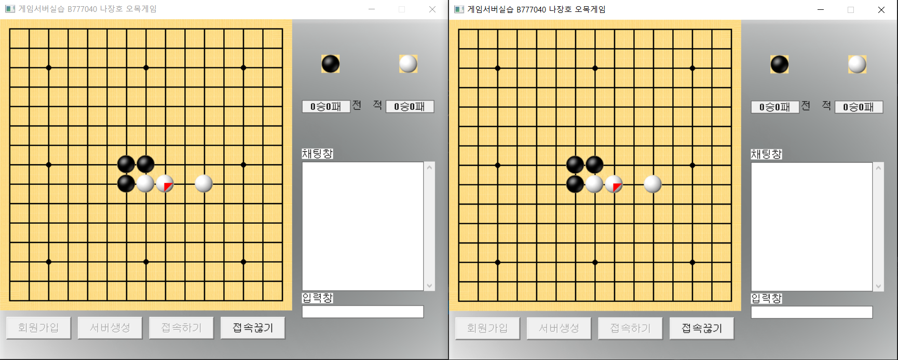

# 프로젝트 개요

* **프로젝트명:** WinAPI 오목 TCP/IP서버 
* **제작기간:** 2개월
* **플랫폼:** PC
* **언어:** C/C++
* **장르:** 오목게임
* **엔진,툴:** WinAPI 응용프로그램

## 프로젝트 설명

  

프로젝트 설명

## 구현 기능

1. TCP/IP 오목 게임기능 연동
2. 채팅 구현
3. 방 생성 구현
4. 오목 규칙 구현

## 배운 점 & 아쉬운 점

처음 서버를 배우고 클라이언트를 연동해본 경험 
간단한 오목게임이라 쉬울줄 알았지만 서버 자체를 연동하는 것은
상당히 복잡하고 까다로운 것을 느꼈음.

